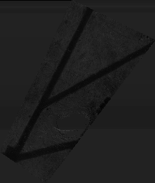
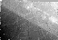

# Curb Detection with LiDAR Point Cloud

This project contains programs that can be used to assist the side walk curb labelling process for HD map - input selected area output label coordinates.

## DEMO

Segment of point cloud in front of Davis Centre Library University of Waterloo: \

projected onto 2D plane according to intensity values: \

extracted crubs and draw on the original image: \

Segment of point cloud between Engineering 7 University of Waterloo and the campus plaza: \

projected onto 2D plane according to z-axis values: \

extracted crubs and draw on the original image: \

> **_INFO:_**  If segmenting point cloud directly is not feasible, functions in "crop_cloud.cpp" can also be used to crop point cloud programmatically. It takes a quadrilateral‘s four coordinates (for x and y axis only) and save the cropped point cloud into a file called "cropped_pcd.pcd".

Please make sure to have cmake and anaconda installed.

> **_NOTE:_**  For simplicity sake the program is currently split into two parts for point cloud and image processing respectively; this should be revised in the future.

## Available Scripts

For MacOS, in the project directory, run:

#### `conda env create -f curb_detection_macos.yml`

to create the virtual enviroment for opencv, 

#### `conda activate curb_detection`

to activate the virtual environment, 

#### `jupyter-notebook`

to launch jupyter notebook.

In the project root directory, create an empty build folder:

#### `mkdir build`

and build the project:

#### `cmake ..`
#### `make`

once built, the following approaches can be applied on a segmented point cloud: 

#### `./flatten_z <PATH-TO-POINT-CLOUD-FILE>`

to project the points on 2D image (saved as "projected_z.png") based on their x_axis values (distinct heights), or: 

#### `./flatten_intensity <PATH-TO-POINT-CLOUD-FILE>`

to project the points on 2D image (saved as "projected_intensity.png") based on their intensity values (distinct materials).

Either program outputs the minimum x and y coordinates for later use in image processing to get the line's coordinates.

In the last cell of the notebook, change the x_min and y_min parameters to the output of the program then run all cells; a tuple of four values indicating the location of the curb will be printed.

> **_NOTE:_**  If segmenting point cloud directly is not feasible, functions in "crop_cloud.cpp" can also be used to crop point cloud programmatically. It takes a quadrilateral‘s four coordinates (for x and y axis only) and save the cropped point cloud into a file called "cropped_pcd.pcd".

## Limitations

- Only one of the two measures can be applied each time on a single case.
- Boundaries between the projected polygon and the empty space of the retangle-shape image potentially causes the algorithm to produce false positive.
- Scaling z-axis values linearly causes the side of the curb with less distinct values to be suppressed and not being detected properly; *only selecting one side* of the curb each time is therefore recommended.
- The labels (lines) do not pertain any information regarding z-axis.

## Future Work

- Replace image processing in python with C++.
- Merge the two measures in the future to provide one single optimized result for all cases.
- Project the lines in 2D coordinates back to the point cloud with appropriate z-axis values.
- Implement better user interface.